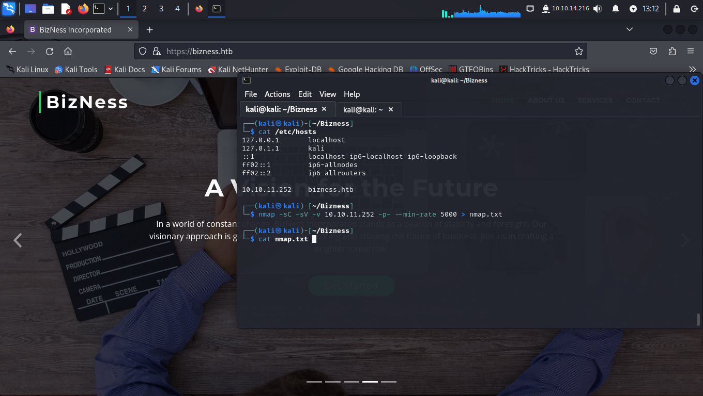
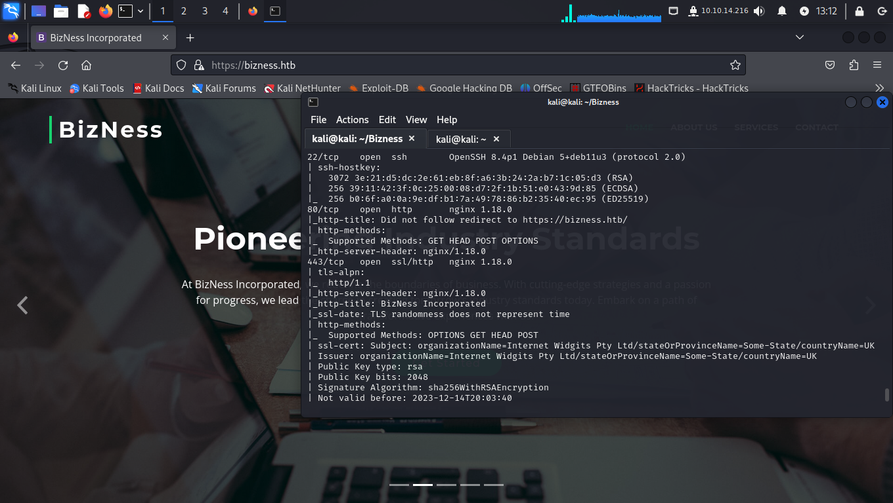
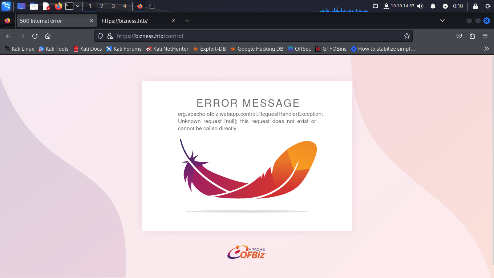
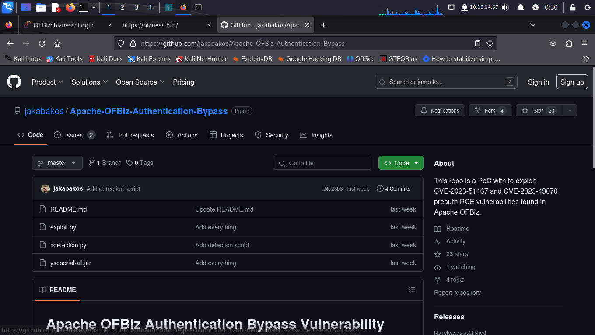
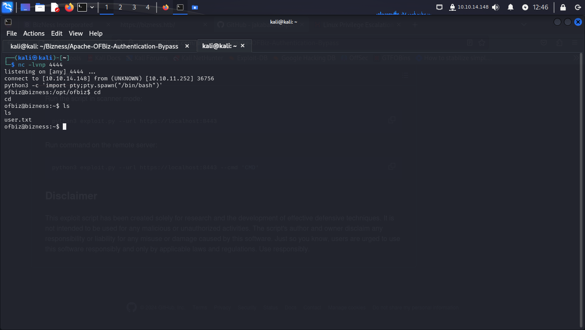
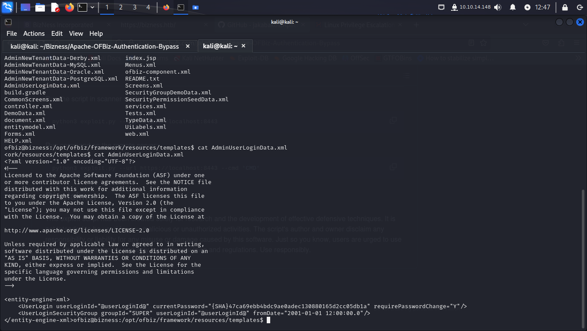
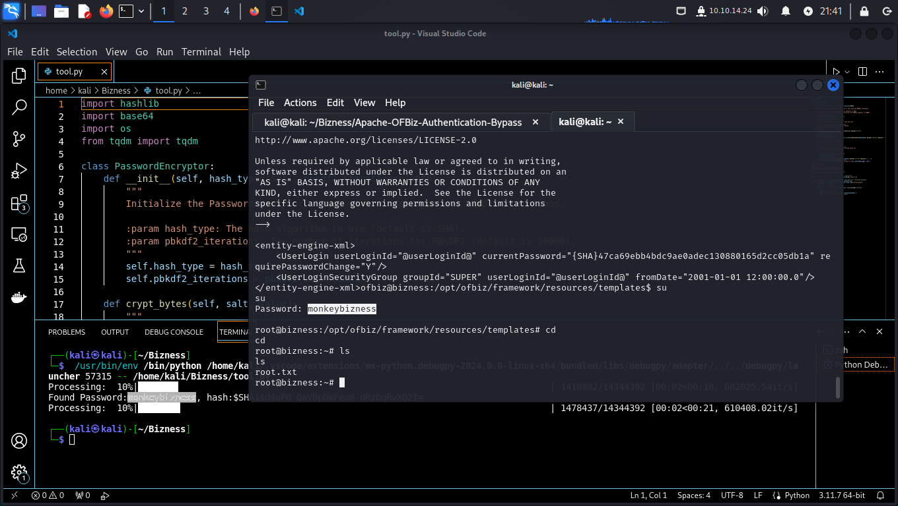

# Bizness


# Recon
Default nmap Scan open Ports:

```python
nmap -Pn -sC -sV -vvv 10.10.11.252 --min-rate 5000 -p- > result.txt 
```



From the NMAP scan, ports 80 and 443 were discoverable.

Visiting directly the IP address ( http://10.10.11.252 ), We added the host in `/etc/Hosts` and now it can be accessed via `bizness.htb`. 



# Enumeration

The next step is to list directories in order to find something that can help us get more information. The tool we used was ffuf.

```python
ffuf -u "https://bizness.htb/FUZZ" -w /usr/share/wordlists/SecLists/Discovery/Web-Content/directory-list-2.3-medium.txt --fw 1

        /'___\  /'___\           /'___\       
       /\ \__/ /\ \__/  __  __  /\ \__/       
       \ \ ,__\\ \ ,__\/\ \/\ \ \ \ ,__\      
        \ \ \_/ \ \ \_/\ \ \_\ \ \ \ \_/      
         \ \_\   \ \_\  \ \____/  \ \_\       
          \/_/    \/_/   \/___/    \/_/       

       v2.1.0-dev
________________________________________________

 :: Method           : GET
 :: URL              : https://bizness.htb/FUZZ
 :: Wordlist         : FUZZ: /usr/share/wordlists/SecLists/Discovery/Web-Content/directory-list-2.3-medium.txt
 :: Follow redirects : false
 :: Calibration      : false
 :: Timeout          : 10
 :: Threads          : 40
 :: Matcher          : Response status: 200-299,301,302,307,401,403,405,500
 :: Filter           : Response words: 1
________________________________________________

control                 [Status: 200, Size: 34633, Words: 10468, Lines: 492, Duration: 2081ms]
```



Well, we found an error page, but there could be more directories together. 

```python
ffuf -u "https://bizness.htb/control/FUZZ" -w /usr/share/wordlists/SecLists/Discovery/Web-Content/directory-list-2.3-medium.txt --fw 10468

        /'___\  /'___\           /'___\       
       /\ \__/ /\ \__/  __  __  /\ \__/       
       \ \ ,__\\ \ ,__\/\ \/\ \ \ \ ,__\      
        \ \ \_/ \ \ \_/\ \ \_\ \ \ \ \_/      
         \ \_\   \ \_\  \ \____/  \ \_\       
          \/_/    \/_/   \/___/    \/_/       

       v2.1.0-dev
________________________________________________

 :: Method           : GET
 :: URL              : https://bizness.htb/control/FUZZ
 :: Wordlist         : FUZZ: /usr/share/wordlists/SecLists/Discovery/Web-Content/directory-list-2.3-medium.txt
 :: Follow redirects : false
 :: Calibration      : false
 :: Timeout          : 10
 :: Threads          : 40
 :: Matcher          : Response status: 200-299,301,302,307,401,403,405,500
 :: Filter           : Response words: 10468
________________________________________________

login                   [Status: 200, Size: 11061, Words: 1236, Lines: 186, Duration: 388ms]
```

When you browse `/control/login` it redirects you to an Apache OFBiz (v18.12 release) login page.
Well, we can search to see if the version is vulnerable.  



Wow, this is a bypass to get. Apache OFBiz Authentication Bypass Vulnerability (CVE-2023-51467 and CVE-2023-49070) here a link for repositore https://github.com/jakabakos/Apache-OFBiz-Authentication-Bypass. 

Now we'll bypass the portal and gain access to a shell.

 

Wow, we get a shell!!!

So now we need a privileged escalation

# Priv-ESc

Let us start with listing all files we have in current directory.

After doing some exploration, I found an interesting file in /opt/ofbiz/framework/resources/templates/AdminUserLoginData.xml



We managed to get a hash of a user!
But we need to decrypt the hash to get the password used by a root user or a user with root privilege.
So, I researched some libraries and codes to implement in a code of my own for this challenge. I'll leave the code for you to use as well.



GREAT! We got root access.
